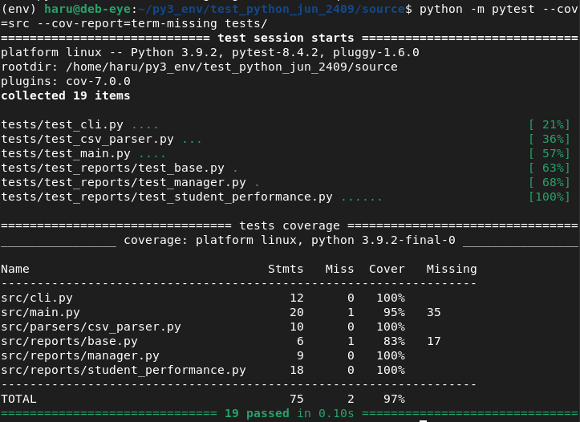
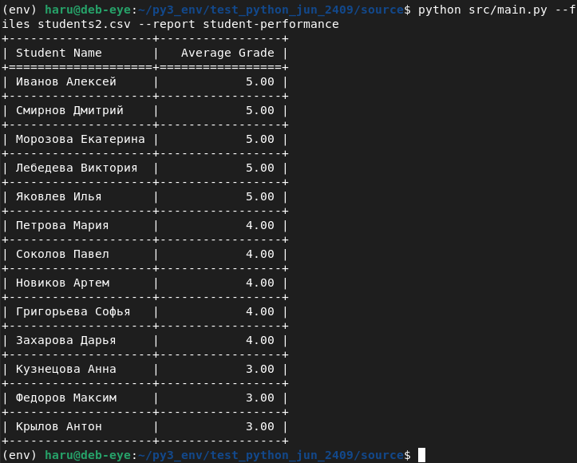
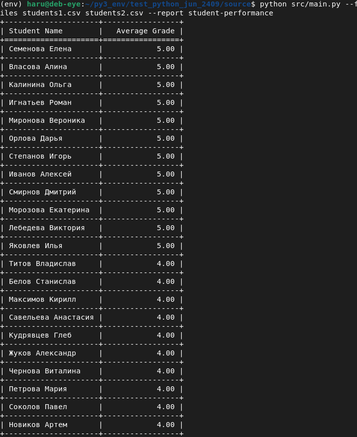
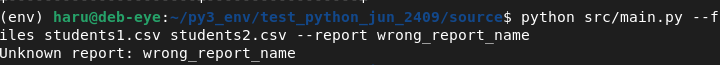
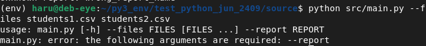
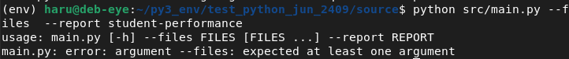
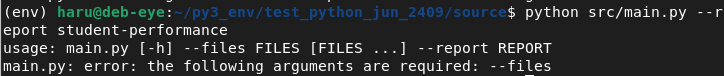

# Student Performance Report Generator

Программа для генерации отчётов об успеваемости студентов из CSV-файлов.

## Установка

```bash
git clone https://github.com/hyd3-me/python_jun_test_24.09.git source
python -m venv env
source /env/bin/activate
cd source
pip install -r requirements.txt
```

## Запуск
```
python src/main.py --files students1.csv students2.csv --report student-performance
```

## Структура проекта
```
source/
├── src/
│   ├── cli.py                 # Обработка аргументов
│   ├── main.py                # Точка входа
│   ├── parsers/
│   │   └── csv_parser.py      # Чтение CSV
│   └── reports/
│       ├── base.py            # Абстрактный класс отчёта
│       ├── manager.py         # Менеджер отчётов
│       └── student_performance.py  # Отчёт по успеваемости
├── tests/
│   ├── test_cli.py
│   ├── test_csv_parser.py
│   ├── test_main.py
│   └── test_reports/
│       ├── test_base.py
│       ├── test_manager.py
│       └── test_student_performance.py
├── requirements.txt
└── README.md
```

## Как добавить новый отчет
```
- Создайте класс, наследующийся от BaseReport.
- Реализуйте метод generate.
- Зарегистрируйте отчёт в ReportManager.
```

### Пример:
```
from reports.base import BaseReport

class NewReport(BaseReport):
    def generate(self, data):
        return "..."
```

## Тесты
```
python -m pytest tests/
```

### Покрытие тестами




## Примеры запуска скрипта:

### запуск для одного файла


### запуск для двух файлов


### запуск с неправильным именем отчета


### запуск без флага отчета


### запуск без указания пути к файлу


### запуск без указания флага файлов
